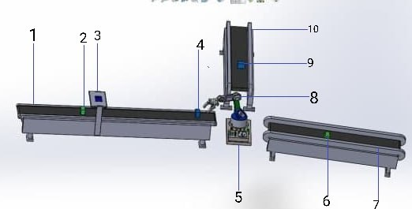
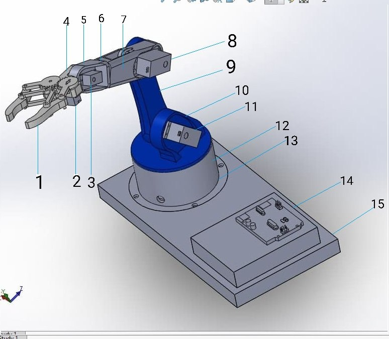

---

# QR-Code-Based-Product-Sorting-Autonomous-Robotic-Arm

## Video Demo

You can watch a demonstration of the robotic arm in action here:

[QR Code-Based Robotic Arm Demo](https://youtu.be/snNzrZxwVzw)

---

## Overview

This project involves the design and development of an autonomous robotic arm system that can sort products using QR code recognition for automated product identification. The system is controlled by an Arduino Uno and consists of a 5-degree-of-freedom (DOF) robotic arm, which includes one DOF at the base, two DOFs at the shoulder and elbow (position axes), and two DOFs at the wrist (orientation axes). The system utilizes a mobile application (QRDUINO) to operate and monitor the robotic arm via Bluetooth connection.

The arm is designed to handle products in a structured environment such as a supermarket for tasks like product identification, sorting, and handling. The system reads multidimensional QR codes, which are robust to the orientation of the objects, allowing it to handle items in various positions. The robot's gripper can handle objects weighing up to 150 grams.

---

## Features

- **Autonomous Sorting**: The robotic arm automatically sorts products by reading QR codes, eliminating manual labor in environments like supermarkets.
- **5 Degrees of Freedom (DOF)**: The robotic arm features 5 DOFs, allowing it to move and manipulate objects efficiently.
- **QR Code Recognition**: The arm uses a QR code scanning system for automated product identification, which is readable in any orientation.
- **Bluetooth Control**: The robotic arm is controlled via a mobile application (QRDUINO) that communicates with the arm using Bluetooth.
- **Affordable and Efficient**: The system is designed with readily available materials and a simple control mechanism, making it cost-effective and easy to build.

---

## Hardware Components

- **Microcontroller**: Arduino Uno
- **Actuators**: Servo motors (MG996R and SG90)
- **Gripper**: Geared mechanism for handling objects
- **Sensors**: QR code reader (mobile phone-based camera)
- **Power Supply**: Power circuits designed to support the servo motors and microcontroller

---

## Software Components

- **QRDUINO Mobile App**: Developed using MIT App Inventor for controlling the robotic arm and scanning QR codes.
- **Arduino IDE**: Used for programming the Arduino microcontroller.
- **Proteus Software**: Used for simulating and testing the robotic arm's circuits.

---

## Functionality

1. **QR Code Generation**: Each product is assigned a unique QR code for identification.
2. **Object Handling**: The arm scans the QR code on the product, identifies it, and places it in the correct location.
3. **Product Sorting**: Based on the QR code, the robotic arm sorts the items into predefined sections (e.g., milk tea, sodas).
4. **Torque and Payload**: The robotic arm can handle objects up to 150 grams. The maximum torque of the arm is 1.44 kg-cm.

---

## Mechanical Design

The robotic arm is modeled using CAD software and includes the following components:
- **Base**: The base supports the arm and allows rotation.
- **Shoulder and Elbow**: These joints enable the arm to move objects in three-dimensional space.
- **Wrist Roll and Wrist Pitch**: These joints provide rotation and elevation control for the gripper.
- **Gripper**: The gripper is used for picking up and placing objects.

---

## System Limitations

- The system is designed for sorting two types of objects.
- The maximum object weight is limited to 150 grams.
- The gripper cannot handle objects thicker than 50 cm.
- The QR code reader is substituted with a mobile phone camera due to availability constraints.

---

## Conclusion

This project demonstrates a practical solution for automating product sorting in environments like supermarkets. The QR code-based identification system, combined with an autonomous robotic arm, significantly reduces labor costs and improves accuracy and safety in sorting products.

---

## Images

### 1. Robotic Arm Model

### 2. Robotic Arm in Action

---

